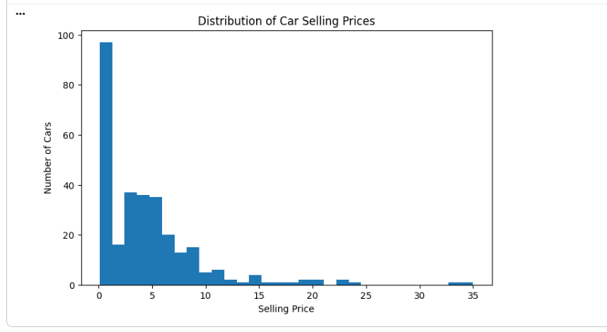
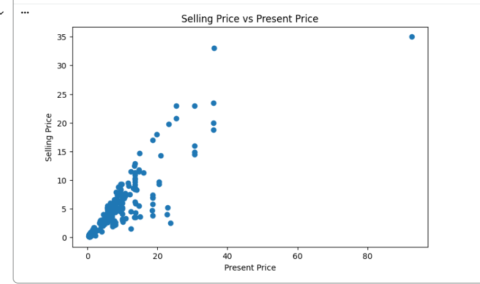
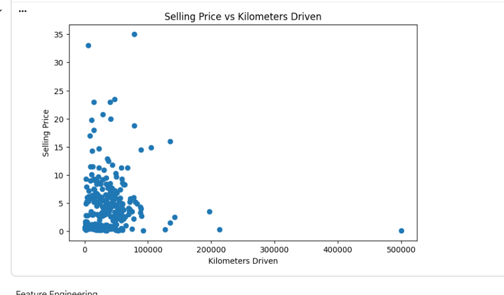
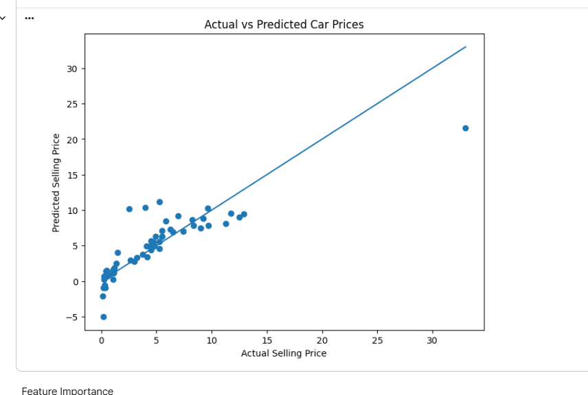
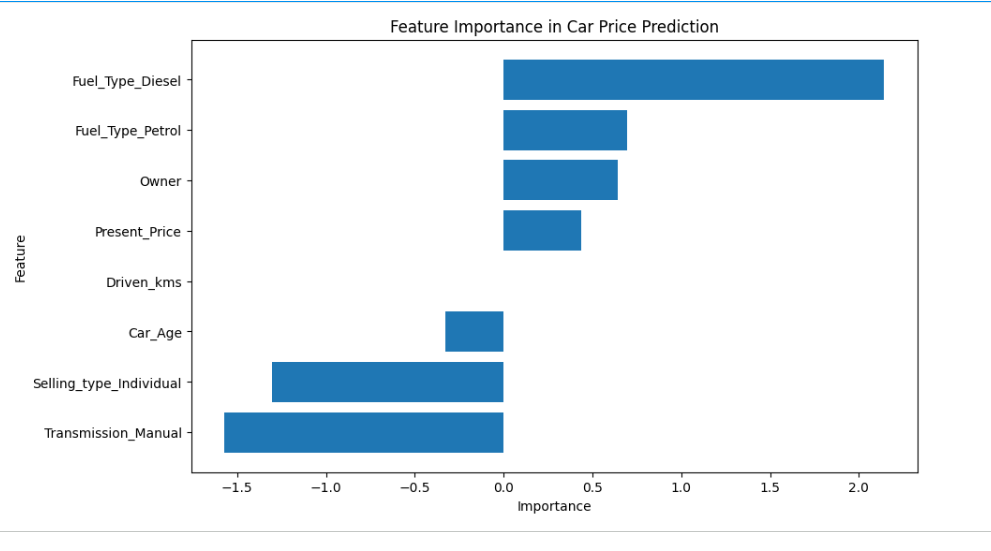

# Car Price Prediction with Machine Learning
CodeAlpha Data Science Internship — Task 3
Project Overview

This project focuses on predicting the selling price of used cars using Machine Learning regression techniques.

The model uses car-related features such as present price, kilometers driven, fuel type, seller type, transmission, owner information, and car age to estimate the selling price of a vehicle.

The project covers the complete Machine Learning workflow, including data preprocessing, exploratory data analysis, feature engineering, model training, prediction, and model evaluation.

## Objective
The main objectives of this project are:

Load and understand the car price dataset.
Clean and preprocess the dataset.
Handle categorical and numerical features.
Perform exploratory data analysis.
Create useful features such as car age.
Analyze relationships between car features and selling price.
Train regression models for price prediction.
Evaluate model performance using appropriate regression metrics.
Compare the performance of different Machine Learning models.
Visualize actual and predicted prices.
Identify important features affecting car prices.
Understand real-world applications of Machine Learning in vehicle price prediction.
Technologies Used
Python — Programming language
Pandas — Data loading, manipulation, and preprocessing
NumPy — Numerical operations
Matplotlib — Data visualization
Seaborn — Statistical data visualization
Scikit-learn — Machine Learning models, preprocessing, and evaluation
Google Colab — Development and execution environment
GitHub — Project version control and documentation
Dataset

The project uses a used-car dataset containing information about different cars and their selling prices.

## Dataset Features
Feature	Description
Car_Name	Name of the car
Year	Manufacturing year of the car
Selling_Price	Selling price of the car — target variable
Present_Price	Current/ex-showroom price of the car
Kms_Driven	Total kilometers driven
Fuel_Type	Type of fuel used by the car
Seller_Type	Type of seller
Transmission	Transmission type
Owner	Number of previous owners
Target Variable

Selling_Price

The Machine Learning models are trained to predict the selling price of a used car based on its available features.

Data Preprocessing

The following preprocessing steps were performed:

Loaded the dataset using Pandas.
Inspected the dataset structure and data types.
Checked for missing values.
Checked for duplicate records.
Converted categorical variables into numerical representations.
Created relevant features for prediction.
Separated independent variables and the target variable.
Split the dataset into training and testing sets.
Exploratory Data Analysis

Exploratory Data Analysis was performed to understand the relationship between car characteristics and selling prices.

The analysis included:

Distribution of selling prices.
Relationship between present price and selling price.
Effect of kilometers driven on selling price.
Effect of car age on selling price.
Analysis of categorical variables.
Correlation analysis between numerical features.
Visualization of important relationships using graphs.
Feature Engineering

Feature engineering was performed to improve the information available to the Machine Learning models.

Car Age

A new feature called Car Age was created using:

Car Age = Current Year - Manufacturing Year

Car age helps the model understand how depreciation affects the selling price of a vehicle.

Other categorical features were transformed into numerical form so that they could be used by Machine Learning algorithms.

Machine Learning Models

Regression models were trained to predict car selling prices.

The project includes regression techniques such as:

1. Linear Regression

Linear Regression was used as a baseline model to understand the relationship between the input features and selling price.

2. Random Forest Regression

Random Forest Regression was used to capture nonlinear relationships between car features and selling price.

The Random Forest model combines multiple decision trees to produce more robust predictions.

Model Evaluation

The trained models were evaluated using regression performance metrics.

Mean Absolute Error — MAE

MAE measures the average absolute difference between actual and predicted prices.

MAE = Average(|Actual Price - Predicted Price|)

Lower MAE indicates better performance.

Mean Squared Error — MSE

MSE calculates the average squared difference between actual and predicted values.

Lower MSE indicates better performance.

R² Score

R² measures how well the model explains the variation in the target variable.

A value closer to 1 generally indicates better predictive performance.

Model Comparison

The performance of the trained regression models was compared using their evaluation metrics.

The comparison helps identify which model provides better predictions for used-car selling prices.

The detailed numerical results are available in the project notebook.

Project Visualizations
1. Selling Price Distribution

This visualization shows the distribution of car selling prices in the dataset.

2. Present Price vs Selling Price

This visualization shows the relationship between the present price of a car and its selling price.

3. Car Age vs Selling Price

This visualization analyzes how the age of a car affects its selling price.

4. Actual vs Predicted Prices

This visualization compares the actual selling prices with the prices predicted by the Machine Learning model.

5. Feature Importance

This visualization shows the relative importance of different features used by the Machine Learning model.

## Project Visualizations

### 1. Selling Price Distribution

### 2. Present Price vs Selling Price

### 3. Car Age vs Selling Price

### 4. Actual vs Predicted Prices

### 5. Feature Importance

Key Findings

The analysis provides several important observations:

Present price is an important factor in determining the selling price of a used car.
Car age has an influence on vehicle resale value.
The number of kilometers driven can affect the selling price.
Fuel type, seller type, transmission, and ownership history can also contribute to price differences.
Machine Learning regression models can learn relationships between vehicle characteristics and selling prices.
Comparing multiple regression models helps identify a more suitable model for the prediction task.

Note: Exact model performance values such as MAE, MSE, and R² are available in the project notebook.

Real-World Applications

Car price prediction systems can be used in several real-world scenarios:

Used-Car Marketplaces — Estimate reasonable selling prices for listed vehicles.
Dealerships — Support pricing and inventory decisions.
Car Buyers — Help buyers evaluate whether a vehicle is fairly priced.
Car Sellers — Provide an estimated resale value.
Vehicle Valuation Systems — Automate initial price estimation.
Financial Services — Support vehicle valuation for loans and financing.
Automobile Analytics — Analyze factors affecting vehicle resale values.
Conclusion

This project demonstrates how Machine Learning can be applied to a real-world regression problem — predicting used-car selling prices.

The complete workflow includes data preprocessing, exploratory data analysis, feature engineering, regression model training, model evaluation, and visualization.

The project provides practical experience in using Pandas, NumPy, Matplotlib, Seaborn, and Scikit-learn to develop a Machine Learning solution for price prediction.
